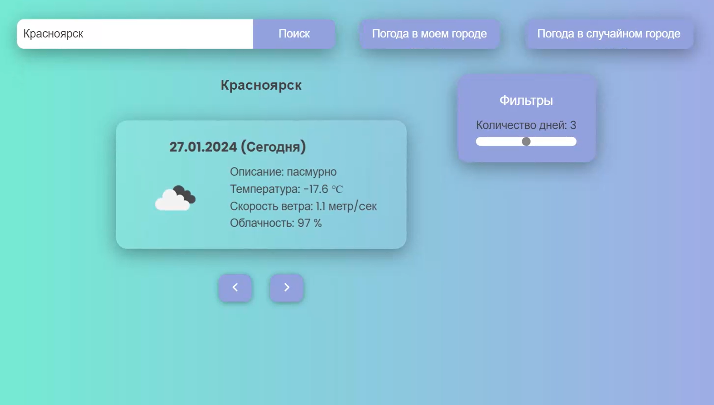

# Приложение для получения информации о погоде
---

## Старт проекта
1. Клиентская часть
    - ```cd .\Client\ ```
    - ```npm run start```
2. Серверная часть
    - ```cd .\Server\```
    - ```npm run dev```
---

## Функционал
#### 1. Возможность найти информацию о погоде по введенному в поисковой запрос городу
#### 2. Поиск погоды в городе вашего нахождения
#### 3. Поиск погоды в случайно выбранном программой городе
#### 4. Возможность задавать фильтр диапазона даты погоды
---

## Используемые технологии
#### 1. Клиентская часть:
- react, react-dom
- styled-components
- materialui, fontawesome
#### 2. Серверная часть: 
- nodejs, express
- axios, puppeteer
- dotenv, cors, @vitalets/google-translate-api (библиотека для перевода текста)

## Преимущества
#### 1. Адаптивность приложения под любые устройства
#### 2. Простой и понятный интерфейс
#### 3. Удобство работы с пользователем (обработка ошибок и их отображение)
---
<figure align="center">
  
  <figcaption>Главная страница</figcaption>
</figure>


